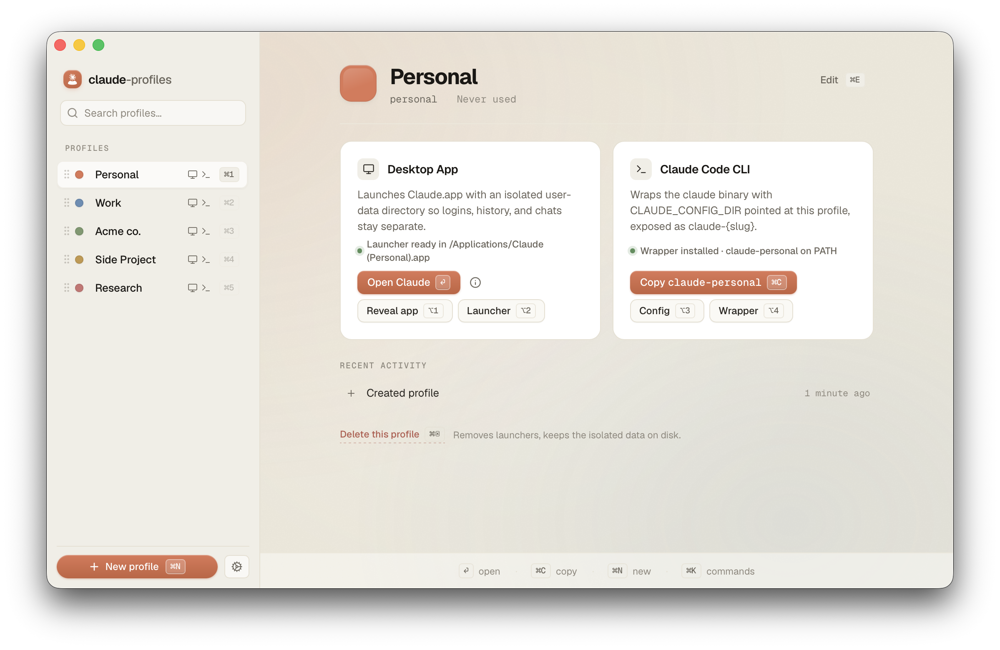

# claude-profiles

> Run multiple Claude and Codex accounts on one Mac — the desktop app and the CLI, side by side. Free and open-source.

<picture>
  <source media="(prefers-color-scheme: dark)" srcset="apps/landing/public/screenshot-dark.png">
  
</picture>

## Landing page

The marketing landing page lives in [`apps/landing/`](apps/landing/README.md) (Astro + Tailwind, deployed to Vercel).

## Install

### Download

Download the latest `.dmg` from [Releases](https://github.com/bartekczyz/claude-profiles/releases/latest). Open it, drag `claude-profiles.app` to `/Applications`. Launch.

### Build from source

```sh
git clone https://github.com/bartekczyz/claude-profiles.git
cd claude-profiles
pnpm install
pnpm --filter claude-profiles tauri build
```

The `.dmg` lands in `apps/claude-profiles/src-tauri/target/release/bundle/dmg/`. macOS will warn on first launch because the local build isn't notarized — right-click the `.app` → Open → Open to bypass Gatekeeper.

## Supported apps

| App | Desktop launcher | CLI wrapper | Auth isolation |
|-----|-----------------|-------------|----------------|
| **Claude** (Desktop + Claude Code CLI) | `Claude (<Name>).app` | `claude-<slug>` (sets `CLAUDE_CONFIG_DIR`) | macOS Keychain entry derived from config dir |
| **Codex** (Desktop + Codex CLI) | `Codex (<Name>).app` | `codex-<slug>` (sets `CODEX_HOME`) | plain `auth.json` inside profile's `CODEX_HOME` — isolation is automatic |

## Using claude-profiles

Create a profile from the sidebar — choose an app (Claude or Codex), give it a name, pick a colour, and choose which surfaces you want (desktop app, CLI, or both). The app generates everything you need on the spot:

- **Desktop app.** A `Claude (<Name>).app` or `Codex (<Name>).app` launcher lands in `/Applications`. Double-click to open the app with that profile's account, history, and settings. Spotlight, Launchpad, Finder, and ⌘-Tab all see it as its own app, tinted with the profile colour.
- **CLI.** A `claude-<slug>` or `codex-<slug>` command appears on your `PATH`. Run it in any terminal to start the CLI with that profile's config and login. Each profile keeps its own session and credentials.

Switch profiles from the sidebar, with ⌘1..⌘9 to jump to a slot, ⌘F to filter the list, or ⌘K to open the command palette. ⌘N creates a new profile, ⌘, opens Settings.

Already using Claude Desktop, Claude Code, or Codex? On first launch the app offers to import your existing setup into your first profile. You can rerun this later from Settings → Data → "Detect and import…".

Deleting a profile from its detail view removes the launcher and CLI wrapper; the profile's data either goes to the Trash or is deleted outright, your choice.

### Usage stats

Each profile's detail page shows that profile's current quota utilization alongside the launcher and CLI buttons. A small countdown tells you when the next auto-refresh will fire (every 5 minutes while the card is visible), or you can hit the ↻ button to refresh on demand.

**Claude profiles** show three meters: the rolling 5-hour window, the 7-day window, and the 7-day Sonnet sub-window. Under the hood the card calls Anthropic's `/api/oauth/usage` endpoint using the profile's own OAuth token, read from the macOS Keychain entry Claude Code created when you signed in. The quota endpoint and the Keychain naming convention are undocumented Anthropic internals — if either changes, the meters may show `—` until we ship a patch.

**Codex profiles** show two meters: the 5-hour window and the weekly window. The card drives `codex app-server` over its JSON-RPC protocol (`account/rateLimits/read`) — no separate auth is needed because the app-server reads from the profile's own `CODEX_HOME/auth.json` directly.

## Onboarding

**First launch.** A welcome dialog appears once; after that you land on the empty state with a single "+ New profile" CTA. There is no auto-prompt — the next step is on you.

**Creating your first profile when you already have Claude or Codex installed.** Clicking "+ New profile" opens a fork dialog with two paths:

- **Just add a new profile, keep existing install as-is** (default — press Enter). Leaves your existing install untouched. `claude` or `codex` keeps working with your current account. The new profile is fully separate and accessed via `claude-<slug>` or `codex-<slug>`.
- **Migrate existing install into a profile.** Adopts your existing `~/.claude` (and `~/Library/Application Support/Claude` if Claude Desktop is installed), or `~/.codex` (and `~/Library/Application Support/Codex` if Codex Desktop is installed), as your first profile. See "What migrate does" below.

### What migrate does

Three steps, in order:

1. **Copies** your existing data into the new profile dir under `~/Library/Application Support/claude-profiles/profiles/<id>/`.
2. **Moves** the originals (`~/.claude` and/or `~/Library/Application Support/Claude` for Claude; `~/.codex` and/or `~/Library/Application Support/Codex` for Codex) into a timestamped backup dir under `~/Library/Application Support/claude-profiles/migration-backup-<timestamp>/`.
3. **Generates** the per-profile launcher (`Claude (<Name>).app` or `Codex (<Name>).app`) and CLI wrapper (`claude-<slug>` or `codex-<slug>` in `~/.local/bin`).

### After migrating

- Use `claude-<slug>` instead of `claude` (or `codex-<slug>` instead of `codex`) to reach your old account. The wrapper sets `CLAUDE_CONFIG_DIR` (Claude) or `CODEX_HOME` (Codex) to the profile dir.
- The plain `claude` or `codex` command still works, but with no `~/.claude` / `~/.codex` present it'll start a fresh install dir on next invocation. It's not broken — it just sees an empty config.
- **Claude profiles:** you'll be prompted to log in once. macOS Keychain service names are derived from `CLAUDE_CONFIG_DIR`, so credentials don't carry across.
- **Codex profiles:** auth is stored in `auth.json` inside `CODEX_HOME`, so a `codex login` re-run in the new profile dir is all that's needed.
- Settings, history, MCP config, and project memory all come with the migration.

### Reverting a migration

Backups stay on disk for 7 days, then auto-delete. To roll back manually before then:

For a Claude migration:
```sh
# 1. Delete the profile from claude-profiles (Trash or keep, your choice).
# 2. Restore the originals from the backup dir:
mv ~/Library/Application\ Support/claude-profiles/migration-backup-<timestamp>/.claude ~/.claude
mv ~/Library/Application\ Support/claude-profiles/migration-backup-<timestamp>/Claude ~/Library/Application\ Support/Claude
# 3. Open Claude. It'll see your old config again.
```

For a Codex migration:
```sh
# 1. Delete the profile from claude-profiles (Trash or keep, your choice).
# 2. Restore the originals from the backup dir:
mv ~/Library/Application\ Support/claude-profiles/migration-backup-<timestamp>/.codex ~/.codex
mv ~/Library/Application\ Support/claude-profiles/migration-backup-<timestamp>/Codex ~/Library/Application\ Support/Codex
# 3. Open Codex. It'll see your old config again.
```

### Triggering migration later

If you picked "just add a new profile" but later change your mind, open **Settings → Data → Re-import…** (or press ⌘I). The same migration flow runs.

### Resetting onboarding

**Settings → Reset onboarding flags** shows the welcome dialog (and the fork dialog) again on next launch. It does not touch profiles, backups, or your theme.

## FAQ

**Why do I have to log in to Claude Code again after importing my existing install?**
The Keychain service name is derived from your `CLAUDE_CONFIG_DIR`, which changes when you move into a per-profile directory. The credentials don't carry over. You only need to log in once per profile.

**Why does the Dock show Claude's regular icon instead of my profile's color?**
The launcher `.app` immediately execs the real Claude.app, so the running Dock icon belongs to Claude. The custom color shows up in Spotlight, Finder, Launchpad, and Cmd-Tab — anywhere the launcher itself is referenced. We're tracking better Dock-icon options for v1.1.

**My new profile launcher doesn't open as `claude-<slug>` from my terminal.**
`~/.local/bin` isn't on your PATH. Open Settings → System and click "Install / re-install hook", or add the line manually to your `.zshrc` / `.bashrc` / `config.fish`. Open a new terminal to pick up the change.

**Does this send any of my data anywhere?**
No. The app is local-only and has no analytics, no telemetry, no remote logging. Auto-update checks the GitHub Releases manifest and that's the only outbound request.

**Can I migrate later if I skipped the first-run prompt?**
Yes — Settings → Data → "Detect and import…".

**Is this safe? What about my credentials?**
Each Claude profile gets a separate Keychain entry derived from its config directory. We don't read or copy your credentials; Claude Code handles all of that. The CLI isolation behavior depends on undocumented Claude Code internals (its SHA-256 service-name derivation), and could break in a future Claude Code release. If it does we'll patch.

Codex profiles store credentials in a plain `auth.json` inside each profile's `CODEX_HOME` directory. Isolation is automatic — there is no Keychain involvement.

**The usage meters on the profile detail page show `—` instead of numbers — what's wrong?**
For Claude profiles, the card calls Anthropic's `/api/oauth/usage` endpoint, which is undocumented and may change shape without notice. If the response stops matching what we parse, the affected meters render as `—` rather than crashing. Note that the first refresh after a fresh install triggers a macOS Keychain access prompt — click "Always Allow" so it doesn't recur.

For Codex profiles, the card drives `codex app-server` over JSON-RPC. If the Codex CLI is not on your `PATH` or the JSON-RPC protocol changes, the meters will show `—`. File an issue and we'll patch.

**Why "Settings" instead of "Preferences"?**
macOS deprecated "Preferences" in favor of "Settings" in Ventura. We follow the current convention.

## Support

If claude-profiles saves you time, you can [buy me a coffee](https://buymeacoffee.com/bartekczyz). It helps keep the project active — thanks!

## Not affiliated with Anthropic or OpenAI

claude-profiles is an independent project. It is not endorsed by, affiliated with, or supported by Anthropic or OpenAI. "Claude" and "Anthropic" are trademarks of Anthropic, PBC. "Codex" and "ChatGPT" are trademarks of OpenAI.

## Acknowledgements

claude-profiles is inspired by [Multi-Claude](https://multiclaude.app/), a paid macOS app that pioneered the `--user-data-dir` profile-wrapper approach for Claude Desktop. claude-profiles extends the idea to the Claude Code CLI and ships free + open-source.

## License

[MIT](./LICENSE)
